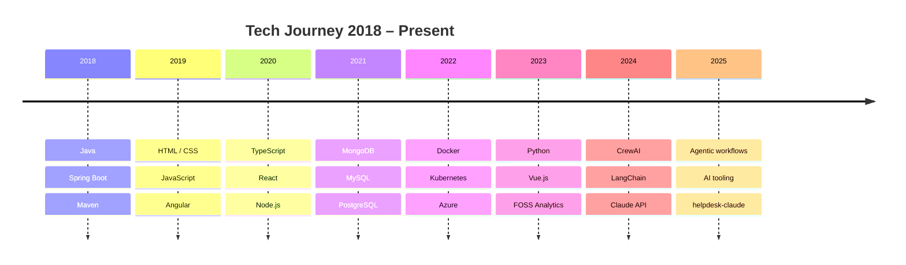

# Pratik Sharma

_Senior Software Engineer · FOSS Analytics · Copenhagen, Denmark_

---

## 👤 About me

- Based in **Copenhagen, Denmark** — originally from India
- Senior Software Engineer at **[FOSS Analytics](https://www.fossanalytics.com/en/)**
- Building full-stack web apps with **React**, **Angular**, **Vue**, and **Node.js**
- Working across **Azure**, **Docker**, **Kubernetes**, and cloud-native architectures
- Exploring **AI-driven agentic workflows** — CrewAI, LangChain, Claude API
- Writing about tech and nomadic life at [@NomadicPratik](https://twitter.com/NomadicPratik)

---

## 🔧 Tech stack

### Frontend

### Backend

### Database

### DevOps & cloud

### AI & agentic workflows

_CrewAI · LangChain · Claude API · OpenAI_

---

## 📦 Featured projects

<table>
  <tr>
    <td>
      
    </td>
    <td>
      
    </td>
  </tr>
  <tr>
    <td>
      
    </td>
    <td>
      
    </td>
  </tr>
  <tr>
    <td>
      
    </td>
    <td>
      
    </td>
  </tr>
</table>

---

## 📊 GitHub stats

<table>
  <tr>
    <td>
      
    </td>
    <td>
      
    </td>
  </tr>
  <tr>
    <td colspan="2" align="center">
      
    </td>
  </tr>
</table>

---

## 📈 Tech journey

_A chronological map of technologies, frameworks, and domains — from Java back-end roots through full-stack JavaScript and cloud DevOps, into AI-driven agentic workflows._

---

## 🌐 Connect

