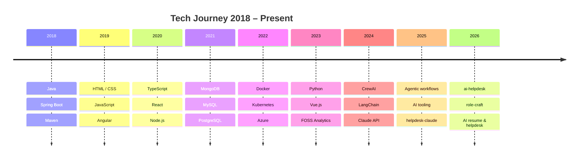

# Pratik Sharma

_Senior Software Engineer · FOSS Analytics · Copenhagen, Denmark_

---

## 👤 About me

- Based in **Copenhagen, Denmark**, originally from India
- Senior Software Engineer at **[FOSS Analytics](https://www.fossanalytics.com/en/)**
- Building full-stack web apps with **React**, **Angular**, **Python**, **C#** and **Node.js**
- Working across **Azure**, **Docker**, **Kubernetes**, and **cloud-native architectures**
- Exploring **AI-driven agentic workflows** — CrewAI, LangChain, Claude API, OpenAI
- Writing about tech and nomadic life at [@ThatPratik](https://twitter.com/ThatPratik)

---

## 🔧 Tech stack

### Frontend

### Backend

### Database

### DevOps & cloud

### AI & agentic workflows

---

## 📦 Featured projects

<table>
  <tr>
    <td width="25%">
      <h4><a href="https://github.com/ThatPratik/ai-helpdesk">🤖 ai-helpdesk</a></h4>
      
AI ticket management — classifies &amp; auto-resolves support emails

      
      
    </td>
    <td width="25%">
      <h4><a href="https://github.com/ThatPratik/system-design">🏗️ system-design</a></h4>
      
Learning and implementing system design concepts in TypeScript

      
      
    </td>
    <td width="25%">
      <h4><a href="https://github.com/ThatPratik/weather-app-agenticworkflow">⛅ weather-app-agenticworkflow</a></h4>
      
Weather app powered by Python agentic workflows

      
      
    </td>
    <td width="25%">
      <h4><a href="https://github.com/ThatPratik/ECommerce">🛒 ECommerce</a></h4>
      
Microservices e-commerce platform with Clean Architecture in C#

      
      
    </td>
  </tr>
  <tr>
    <td width="25%">
      <h4><a href="https://github.com/ThatPratik/arkanoid">🎮 arkanoid</a></h4>
      
Arkanoid game built with Angular and TypeScript

      
      
    </td>
    <td width="25%">
      <h4><a href="https://github.com/ThatPratik/rock-paper-scissors-lizard-spock">🎲 rock-paper-scissors-lizard-spock</a></h4>
      
Extended Rock Paper Scissors in TypeScript

      
      
    </td>
    <td width="25%">
      <h4><a href="https://github.com/ThatPratik/automata">⚙️ automata</a></h4>
      
Cellular automata visualizer in JavaScript

      
      
    </td>
    <td width="25%">
      <h4><a href="https://github.com/ThatPratik/expense-tracker-claude">💸 expense-tracker-claude</a></h4>
      
Expense tracker powered by Claude AI integration

      
      
    </td>
  </tr>
</table>

---

## 📊 GitHub stats

---

## 📈 Tech journey

_A chronological map of technologies, frameworks, and domains — from Java back-end roots through full-stack JavaScript and cloud DevOps, into AI-driven agentic workflows._

---

## 🌐 Connect

